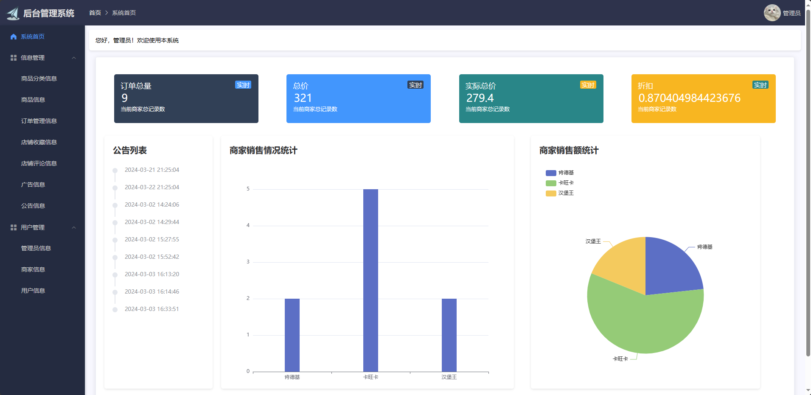

<h1 align="center">基于SSM的外卖点餐小程序（Uniapp实现）</h1>

 获取sql文件 QQ: 386869957 QQ群: 377586148 

 [个人站点: 从戎源码网](https://armycodes.com/)

## 简介

> 本代码来源于网络,仅供学习参考使用!
>
> 提供1.远程部署/2.修改代码/3.设计文档指导/4.框架代码讲解等服务
>
> 前端首页：http://localhost:8081/
> 
> 小程序端首页：http://localhost:8080/#/pages/login/login
>
> 管理员: admin 密码: 123456
>
> 商家：naixue 密码: 123456
>
> 用户：zhangsan 密码: 123456
>

## 项目介绍

基于SSM的外卖点餐小程序（Uniapp实现）：前端 Uniapp、Vue、ElementUI，后端 SpringBoot、Mybatis，系统角色分为：管理员、商家和用户，管理员在管理后台管理店铺，对公告进行发布，添加新管理员等；商家对商品发布等；用户根据发布的商品进行购物等。主要功能如下：

### 启动方式

- 前端：
> cd vue
>
> npm install
>
> npm run serve
>
- 小程序端
> 
> 按钮启动 | 进入HBuilderX —> 运行 -> 运行到浏览器 -> chrome Or edge

- 后端：
> 按钮启动 | 右键run SpringbootApplication

### 管理员：

- 基本操作：登录、修改个人信息、上传图片、获取个人信息、修改密码
- 商品分类信息管理：获取商品分类列表、筛选商品分类信息、新增商品分类信息、删除商品分类信息、编辑商品分类信息
- 商品信息管理：获取商品列表、筛选商品信息、新增商品信息、删除商品信息、编辑商品信息、下架、上架
- 订单管理：获取订单列表、筛选订单信息、删除订单信息、编辑订单信息、查看订单详情
- 店铺收藏信息管理：获取店铺收藏列表、筛选店铺收藏信息、删除店铺收藏信息
- 店铺评论管理：获取店铺评论列表、筛选店铺评论信息、删除店铺评论、店铺评分
- 广告管理：获取广告列表、筛选广告信息、删除广告信息、发布广告、修改广告内容
- 公告管理：获取公告列表、筛选公告信息、删除公告信息、发布公告、修改公告内容
- 公告管理：获取公告列表、筛选公告信息、删除公告信息、发布公告、修改公告内容
- 用户管理：获取管理员列表、筛选管理员信息、修改管理员信息、删除管理员信息、添加管理员、获取商家列表、筛选商家信息、修改商家信息、删除商家信息、添加商家、获取用户列表、筛选用户信息、修改用户信息、删除用户信息、添加用户

### 商家：

- 基本操作：登录、修改个人信息、上传图片、获取个人信息、修改密码、上传营业执照
- 商品分类信息管理：获取商品分类列表、筛选商品分类信息、新增商品分类信息、删除商品分类信息、编辑商品分类信息
- 商品信息管理：获取商品列表、筛选商品信息、新增商品信息、删除商品信息、编辑商品信息、下架、上架
- 订单管理：获取订单列表、筛选订单信息、查看订单详情
- 店铺收藏信息管理：获取店铺收藏列表、筛选店铺收藏信息、删除店铺收藏信息
- 店铺评论管理：获取店铺评论列表、筛选店铺评论信息、删除店铺评论

### 用户：

- 基本操作：登录、注册、修改个人信息、上传图片、获取个人信息
- 商家管理：获取热门商家列表、筛选热门商家信息、查看评价、收藏商家
- 商品管理：获取商品列表、筛选商品信息、加入购物车
- 订单管理：获取订单列表、删除订单、确认收货、评价订单、下单、支付、退款
- 个人中心：获取收货列表、添加收货地址、获取收藏列表、查看收藏商家、取消收藏、收藏商家、获取评价列表、获取浏览历史、关于我们、用户协议

## 环境

- <b>IntelliJ IDEA 2020.3</b>

- <b>HBuilderX 3.7.9.20230324及以上</b>

- <b>Mysql 5.7.26</b>
  
- <b>NodeJs 14.17.3</b>

- <b>Maven 3.6.3</b>

- <b>JDK 1.8</b>

## 运行截图

